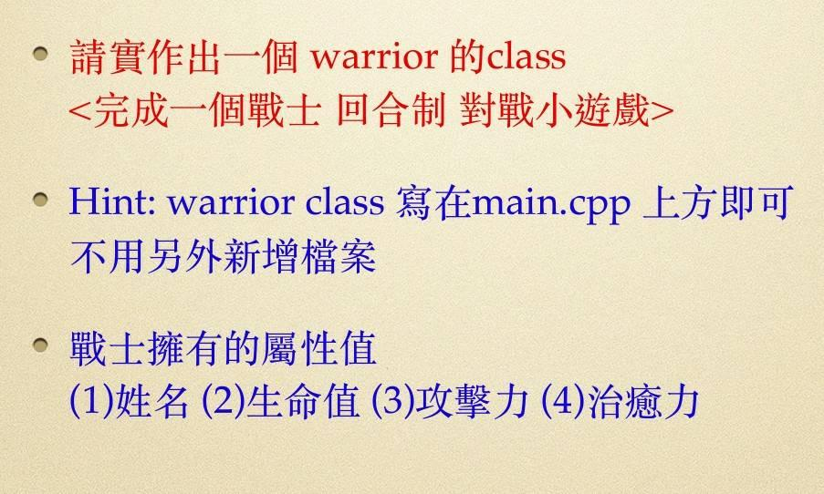
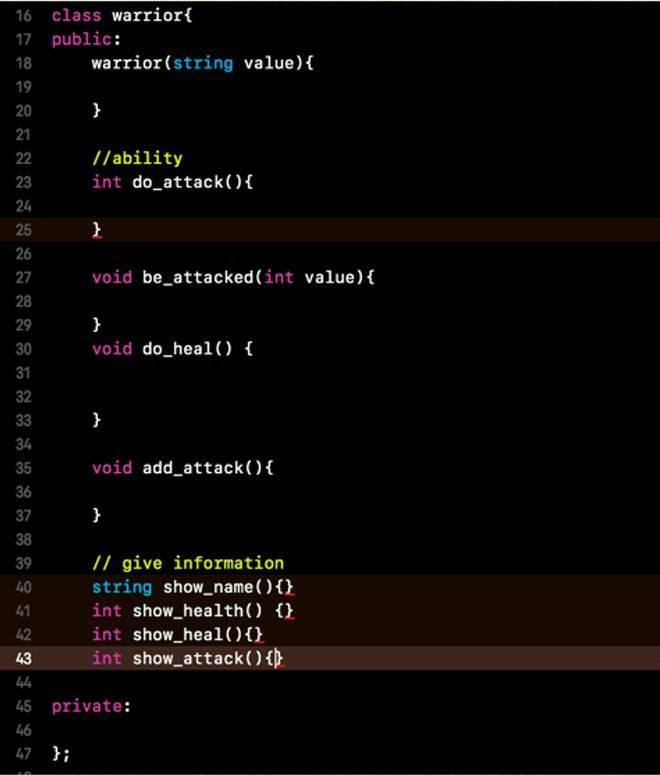
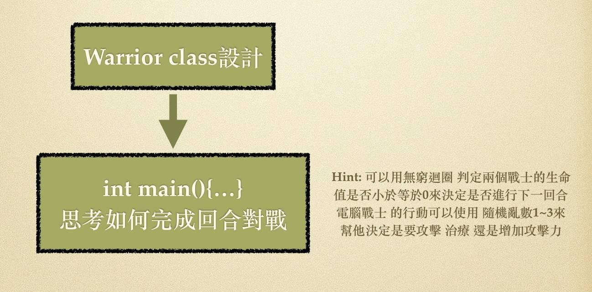
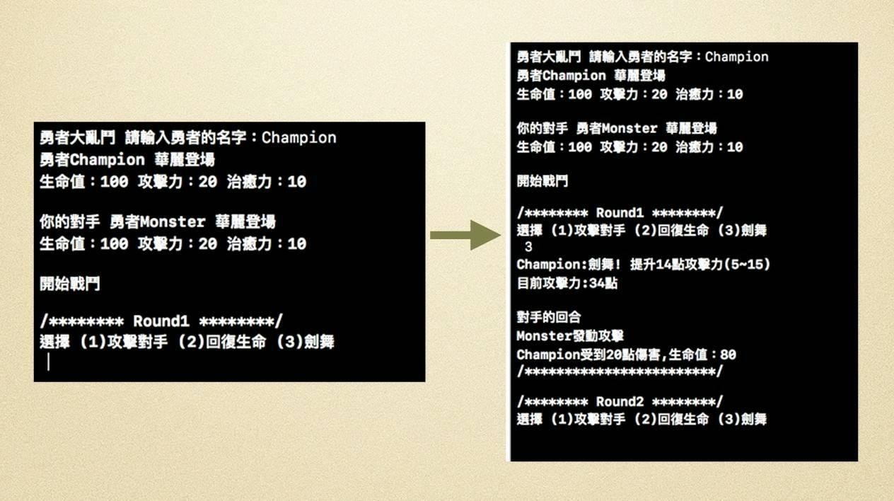
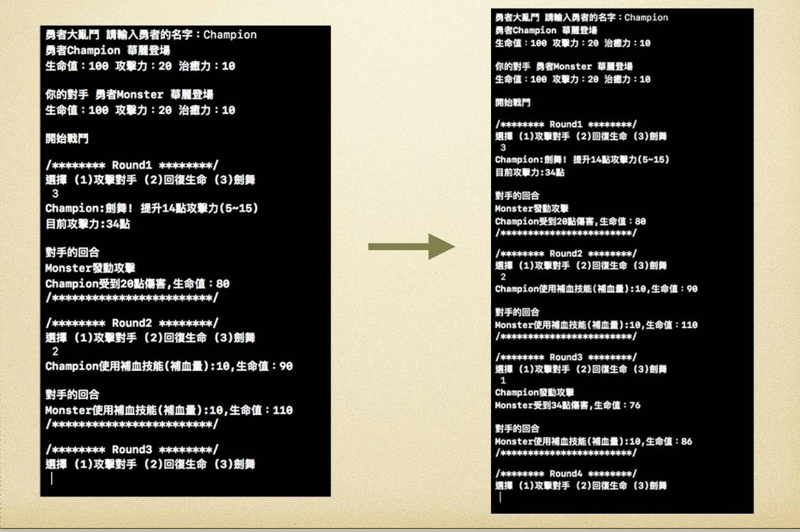
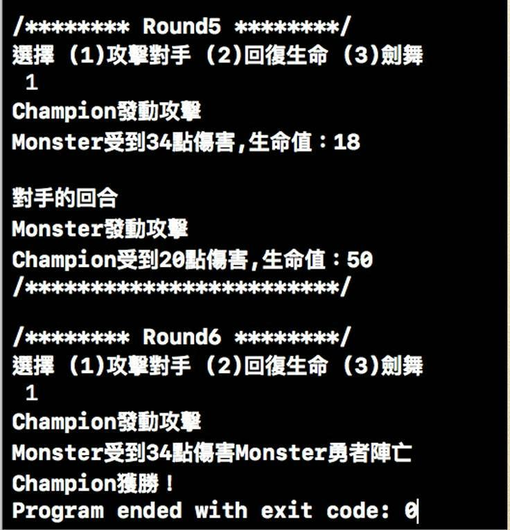

# 原始題目貼文

シリサ フォックス 分享了 他的第一則貼文。  
新成員 · 1 小時  
【新人報到+求救】  
大家好，這裡是剛入社團的萌新，最近在自學C++  
下面這題關於class的題目，我需要大佬用.cpp檔幫我示範，跪求好心人救救我這個萌新  

https://www.facebook.com/groups/1403852566495675/permalink/2545935012287419/

## 題目01

## 題目02

## 題目03

## 題目04

## 題目05

## 題目06

## 題目07

於 西元2020年02月12日 17時28分23秒 【GMT +8】 更新  
原始題目貼文已被刪除。
